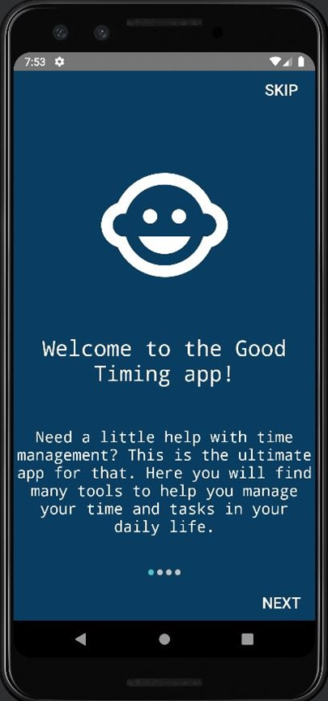

# Good_Timing
Good Timing! Android App

“Good Timing!” is an app made for users that want to keep track of their daily life. It’s a good app for 
the people that don’t want to get caught off guard by any unforeseen obligations, assignments or commitments. 
The app helps the user keep track of their daily shores, special occasions and overall daily needs with tools like a calendar, To-do list, 
stopwatch and a journal for more personal and customized entries. 

  
  

<h2>To-do List</h2>

  
  

<h2>Events</h2>

  

<h2>Timer & Music</h2>

  
  

<h2>Calendar</h2>

  

<h2>Journal</h2>

  

